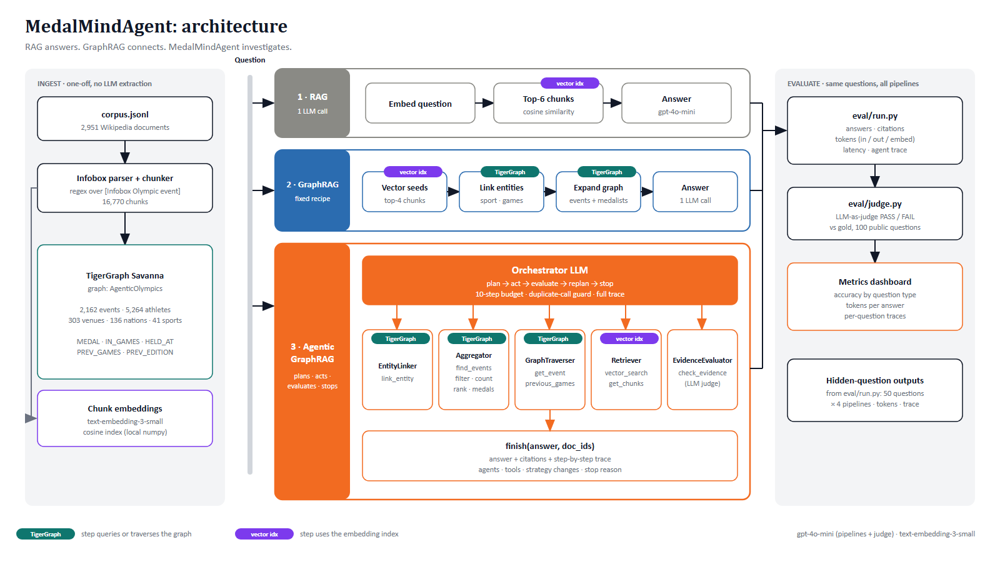

# MedalMindAgent

**RAG answers. GraphRAG connects. MedalMindAgent investigates.**

Agentic GraphRAG on TigerGraph, built to answer one question: when does an agent actually pay off?

Three pipelines answer the same questions over the same corpus, and we measure accuracy, completeness and token cost for each:

1. **RAG**: embed the question, take the top-6 chunks, make one LLM call.
2. **GraphRAG**: a fixed recipe, with no planning. It uses vector seeds, entity linking, one-hop expansion in TigerGraph and one LLM call.
3. **Agentic GraphRAG**: an orchestrator LLM that plans, calls specialised agents/tools, evaluates evidence, switches tactics and decides when to stop. Every step is traced.

A fourth variant, an **adaptive router**, tests whether a cheap classifier can skip the agent for easy questions. It does not help here (see below).

Everything runs on **TigerGraph Savanna** (graph storage, typed filtering, traversal) with OpenAI `gpt-4o-mini` and `text-embedding-3-small`.

## Results (100 public questions, LLM-as-judge)

| | RAG | GraphRAG | **Agentic GraphRAG** | Adaptive router |
|---|---|---|---|---|
| **Accuracy** | 53% | 58% | **97%** | 93% |
| Avg total tokens / answer | 2,498 | 3,051 | 3,024 | 3,019 |
| Avg latency | 1.7 s | 13.9 s | 7.1 s | 5.7 s |
| Avg LLM calls | 1.0 | 1.0 | 2.4 | 3.0 |

Accuracy by question type (correct / total):

| Type | RAG | GraphRAG | Agentic | Agent avg steps | Agent tokens vs RAG |
|---|---|---|---|---|---|
| aggregation (count / threshold) | 0/21 | 6/21 | **21/21** | 2.0 | 0.9× |
| superlative (highest / lowest) | 4/10 | 7/10 | **10/10** | 2.0 | 1.3× |
| multi_hop (venue + date → event → medalist) | 12/28 | 7/28 | **25/28** | 2.1 | 1.1× |
| temporal ("Games immediately before Y") | 19/22 | 19/22 | **22/22** | 3.2 | 1.5× |
| lookup (one named event) | 18/19 | 19/19 | 19/19 | 2.6 | 1.3× |

### Which questions need an agent?

- **Aggregation and superlatives: yes, decisively.** Similarity search returns the top-k most similar chunks, but counting events with "more than N competitors" needs *every* matching event. RAG scored 0/21. The agent's `find_events` tool runs a typed filter inside TigerGraph, so the count is exact. It used no more tokens than RAG, because it reads a count instead of 6 passages.
- **Multi-hop and temporal: yes.** The graph lets the agent go venue/date → event → medalists, or `PREV_GAMES` → event, in 2-3 calls. GraphRAG's fixed expansion cannot choose which hop to take, so it does not beat RAG.
- **Plain lookups: no, this is where the agent is overkill.** All three reach about 100%, and the agent spends about 30% more tokens (3,349 vs 2,538).
- **Does routing fix that?** We tried (`pipelines/adaptive.py`). A classifier call sends "simple" questions to RAG. It saved almost nothing (3,019 vs 3,024 tokens) because the agent is already cheap, and it misrouted 10 venue/date questions as simple, costing 4 points. **Recommendation: always run the agent on this corpus.**

## Architecture



Vector version: [docs/architecture.svg](docs/architecture.svg). Mermaid source: [docs/architecture.md](docs/architecture.md).

```
corpus.jsonl ─ parse infoboxes (regex, no LLM) ─> TigerGraph  Doc/Chunk/Event/Games/Sport/Venue/Athlete/Nation
                                                  + chunk embeddings (local cosine index)
Orchestrator ─┬─ EntityLinker      link_entity
              ├─ Aggregator        find_events (filter / count / rank / medals, pushed down to TigerGraph)
              ├─ GraphTraverser    get_event, previous_games
              ├─ Retriever         vector_search, get_chunks
              ├─ EvidenceEvaluator check_evidence
              └─ finish(answer, doc_ids)
```

Design choices worth knowing:
- **The graph is built deterministically** from the Olympic infoboxes (2,162 events, 5,264 athletes, 136 nations). No LLM extraction, so ingest is cheap and reproducible.
- **Typed attributes make aggregation exact.** The agent never counts by reading text.
- **Exact venue+date disambiguation.** When several events overlap a venue and date, the tool narrows to the event recorded with exactly that date.
- **Loop guard.** Repeating an identical tool call returns an error that pushes the agent to change strategy.
- **Metering.** `llm.py` counts input, output and embedding tokens and latency per question, thread-safely.

## Reproduce

```bash
cd agentic-graphrag
python -m venv .venv && .venv/Scripts/pip install -r requirements.txt     # Windows; use .venv/bin on Linux/macOS
cp .env.example .env        # fill in OPENAI_API_KEY, TG_HOST, TG_USERNAME, TG_PASSWORD
# 1. create the schema in your TigerGraph Savanna workspace
python -c "import tg; print(tg.gsql(open('ingest/schema.gsql').read()))"
# 2. load the graph and build embeddings (~7 min, ~$0.11 of embeddings)
python -m ingest.load_graph
# 3. run pipelines and judge
python -m eval.run --split public --pipelines rag graphrag agentic adaptive
python -m eval.judge
python -m eval.run --split hidden --pipelines rag graphrag agentic
# 4. dashboard
python -m dashboard.build      # writes dashboard/index.html
```

`hackathon-resources/` (corpus and questions) must sit next to this folder.

Outputs: `results/{public,hidden}_{pipeline}.jsonl` hold one row per question with the answer, citations, token breakdown, latency and the full agent trace. `submission/hidden_outputs.json` is the combined file for the 50 hidden questions.

## Honest notes and limitations

- **We tuned on the public set.** The agent went 89% → 96% → 97% across three iterations, each fixing real tool bugs found in failure traces (the iteration results are in `results/archive/`):
  1. The TigerGraph REST filter silently returns nothing for string values with spaces, so those matches moved to Python.
  2. The agent looped on entity linking for temporal questions. We added a recipe to the prompt, plus `include_medals` and a duplicate-call guard.
  3. Several events share a venue and date, so the tool now prefers the exact match.
  The hidden-set accuracy is unknown to us, and expect it to be somewhat lower than the public score.
- **Remaining public failures (3, all multi-hop):** pub-060 and pub-099 name a venue and date where several events are recorded, so the question does not identify a unique event. In pub-073 the date is a composite string ("21 September 2000 (slow)22 September 2000 (fast)"). The agent split it into two dates, which defeated the exact-match rule.
- **Judge:** accuracy is LLM-as-judge (`gpt-4o-mini`) against the gold answers. Completeness equals accuracy here because almost all gold answers are single items.
- **Grounding metric under-credits the agent.** It records citations only from the first 10 rows of a result, so aggregation answers (which depend on many events) look less grounded than they are.
- **Vectors live in a local numpy index**, not in TigerGraph's vector attributes. Graph structure, filtering and traversal are all in TigerGraph.
- **Not built:** the Round 2 capabilities (conflicting or evolving facts, source authority, uncertainty).

Corpus text is derived from English Wikipedia (CC BY-SA 4.0).
