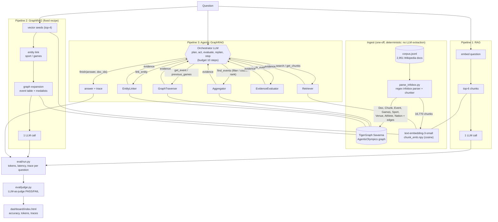

# Architecture

Vector source: [architecture.svg](architecture.svg), generated by `make_architecture.py`. The Mermaid version below is the same design in text form.

## Components

| Component | File | Role |
|---|---|---|
| Graph client | `tg.py` | GSQL + RESTPP (bearer token) access to TigerGraph Savanna |
| LLM wrapper | `llm.py` | Every call metered: input/output/embedding tokens, latency |
| Toolbox | `tools/graph_tools.py` | Tools, grouped by owning specialised agent |
| Pipelines | `pipelines/{rag,graphrag,agentic}.py` | The three systems under comparison |
| Harness | `eval/run.py`, `eval/judge.py` | Resumable runs, LLM-as-judge scoring |
| Dashboard | `dashboard/build.py` | Self-contained HTML with per-question traces |

## Graph schema

`Doc -HAS_CHUNK-> Chunk`, `Doc -IS_EVENT-> Event`, `Event -IN_GAMES-> Games`, `Event -IN_SPORT-> Sport`,
`Event -HELD_AT-> Venue`, `Event -MEDAL{medal,noc}-> Athlete`, `Event -MEDAL_NATION-> Nation`,
`Games -PREV_GAMES-> Games`, `Event -PREV_EDITION-> Event`.

## Why the agent can win where RAG cannot

Aggregation ("how many events had more than N competitors"), superlatives and temporal hops need *every* matching
event, not the top-k most similar chunks. The `Aggregator` runs a typed filter inside TigerGraph; the `GraphTraverser`
follows `PREV_GAMES` / `PREV_EDITION`. Simple lookups stay cheap because the orchestrator stops after one or two calls.
